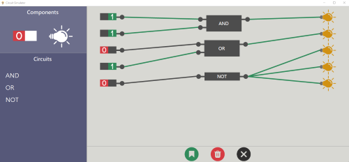

# circu-sim
**Circuit Simulator (Circu-Sim)**

A simple circuit simulator application.
It is intended to help me better explain my video series [Number Bases](https://youtube.com/playlist?list=PL4IUhWJ-QZnPcc7u_CJZJDec6dr429WXz).

You are open to use / modify this code to suit your needs.

# Language & Frameworks
The application is a Windows Form Application which uses .NET 5 framework.
It has no external dependencies. All pictures used are present under resources.

# License
**MIT LICENSE**

**Copyright 2021-2023**

**© Team Info Cu Andrei:**

    Muntea Andrei-Marius        (munteaandrei17@gmail.com)
    Mărginean Ana               (m97ana@gmail.com)

Permission is hereby granted, free of charge, to any person obtaining a copy of this software and associated documentation files (the "Software"), to deal in the Software without restriction, including without limitation the rights to use, copy, modify, merge, publish, distribute, sublicense, and/or sell copies of the Software, and to permit persons to whom the Software is furnished to do so, subject to the following conditions:

The above copyright notice and this permission notice shall be included in all copies or substantial portions of the Software.

THE SOFTWARE IS PROVIDED "AS IS", WITHOUT WARRANTY OF ANY KIND, EXPRESS OR IMPLIED, INCLUDING BUT NOT LIMITED TO THE WARRANTIES OF MERCHANTABILITY, FITNESS FOR A PARTICULAR PURPOSE AND NONINFRINGEMENT. IN NO EVENT SHALL THE AUTHORS OR COPYRIGHT HOLDERS BE LIABLE FOR ANY CLAIM, DAMAGES OR OTHER LIABILITY, WHETHER IN AN ACTION OF CONTRACT, TORT OR OTHERWISE, ARISING FROM, OUT OF OR IN CONNECTION WITH THE SOFTWARE OR THE USE OR OTHER DEALINGS IN THE SOFTWARE.